## 🚀 Features

### 🔐 Authentication & Access Control
- User registration and login system with **JWT-based authentication**.
- **Protected routes** to ensure secure access.
- **Persistent login** using cookies and localStorage.

### 👥 Client Management
- Add, view, edit, and delete clients.
- Link clients to **bills and quotations**.

### 🏢 Subcompany Management
- Support for **multiple subcompanies** under the same application.
- Each invoice/quotation is tied to a specific subcompany for clarity and reporting.

### 🧾 Services Catalog
- Add and manage different types of services.
- Each service includes a **name, price, and optional description**.
- Dynamically used during **invoice or quotation** creation.

### 📄 Invoice & Quotation Creation
- Separate support for **Invoices** and **Quotations**, each with their own auto-generated unique IDs.
- **Format**: `RBS/{YY}/{INV|QT}/{###}`
- Inline service selection with **dynamic price and quantity** entry.
- GST calculation based on tax type:
  - **CGST + SGST** (default)
  - **IGST**
- **Grand total** dynamically calculated including tax.

### 📈 Tax Handling (GST Compliant)
- Smart handling of Indian tax rules:
  - Toggle between **CGST + SGST** or **IGST**
  - Separate rates and amounts tracked for:
    - `taxRate`, `taxAmount`
    - `cgstRate`, `cgstAmount`
    - `sgstRate`, `sgstAmount`
    - `igstRate`, `igstAmount`
  - `taxType` field determines applicable tax mode.

### 📃 PDF Invoice/Quotation Generation
- Auto-generate **PDF documents** for each invoice/quotation using **PDFKit**.
- Includes all bill data, tax breakdowns, and client/subcompany details.
- Downloadable and **printable professional format**.

### 📋 Bill Listing and Status Management
- View a list of all bills and quotations.
- Filter by **client**, **type** (invoice/quotation), and **status**.
- Status options:
  - `Paid`
  - `Unpaid`
  - `Partially Paid`
- Update bill status post-payment.

### 🔎 Filtering, Pagination, and Search
- **Server-side filtering and pagination** for efficient data retrieval.
- **Real-time search** for clients, services, or bills.

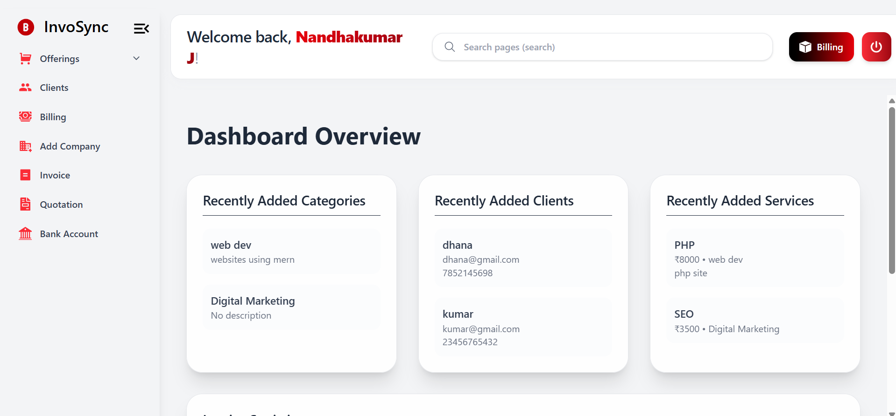
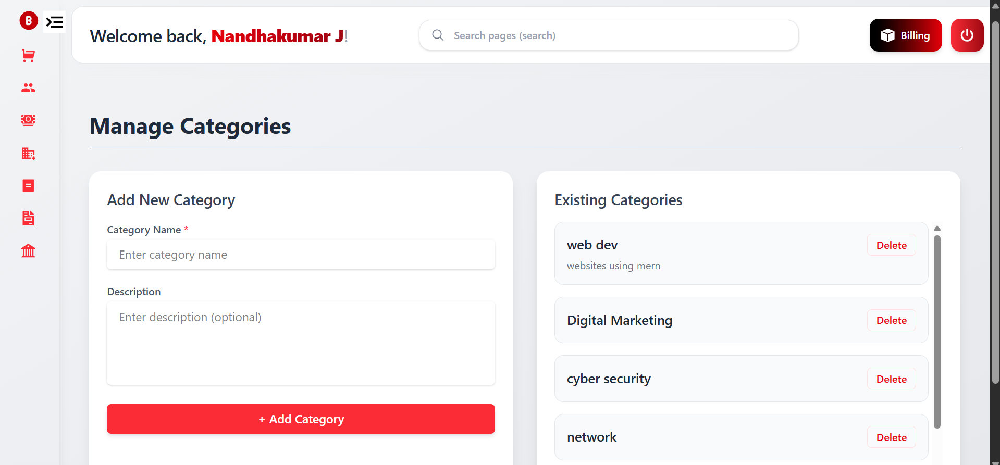
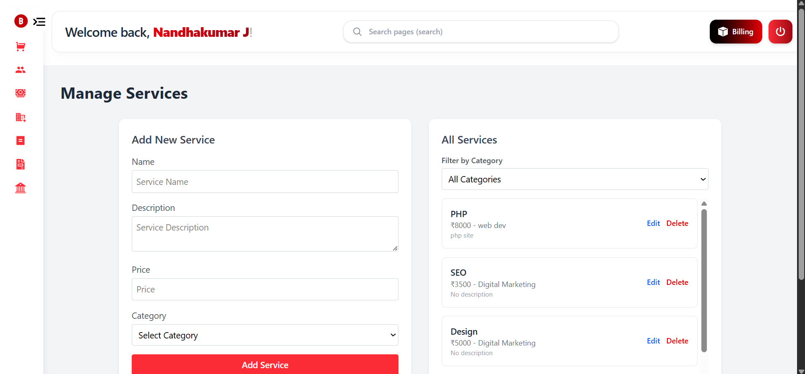
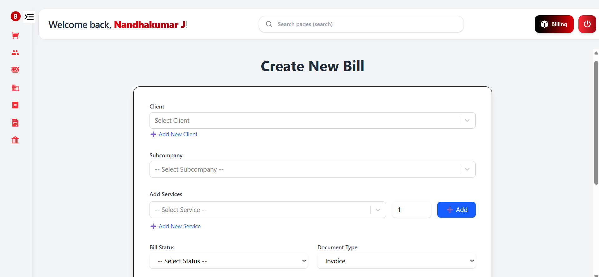
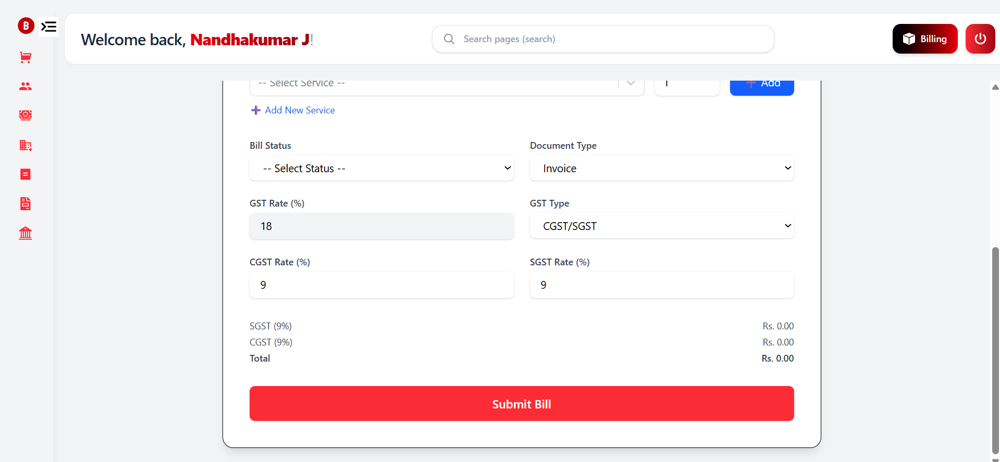
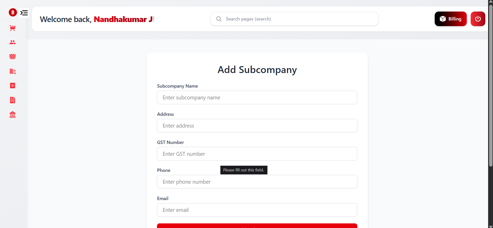
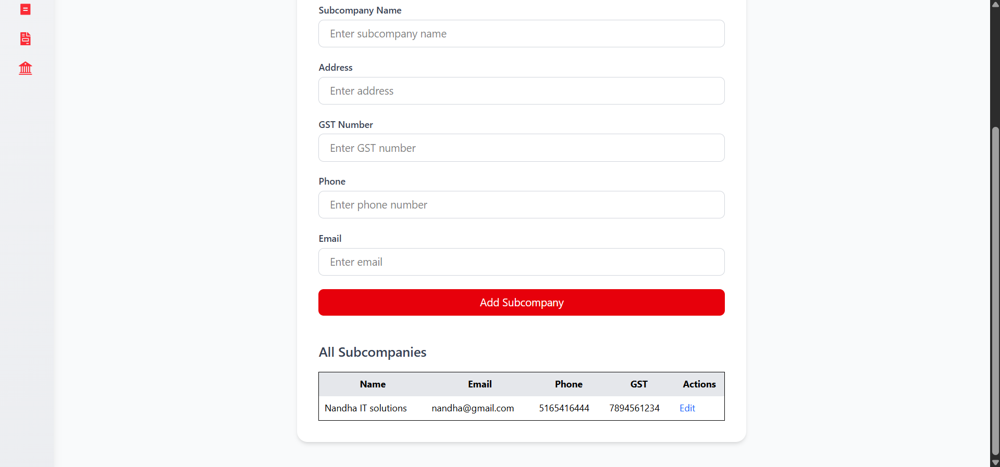
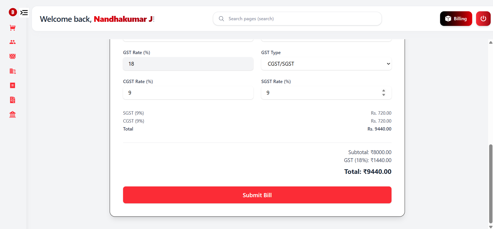
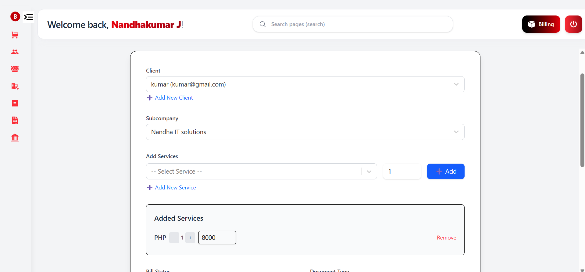
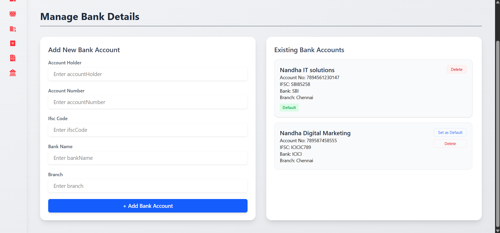
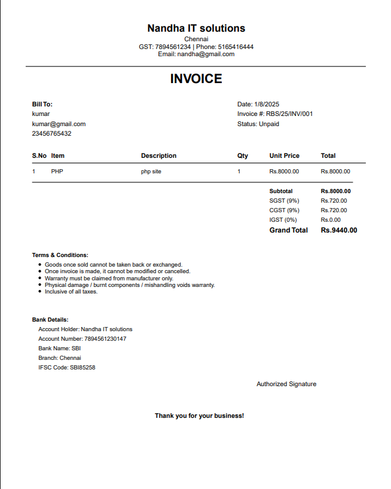
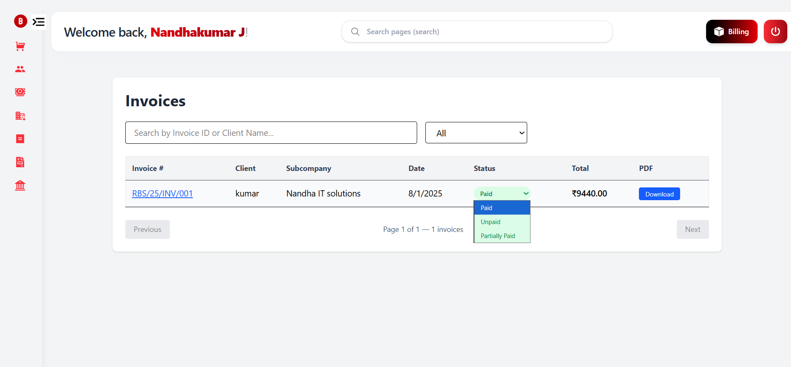
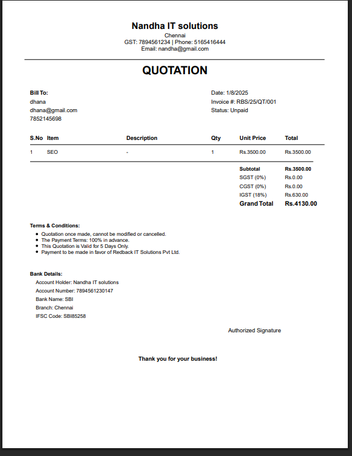
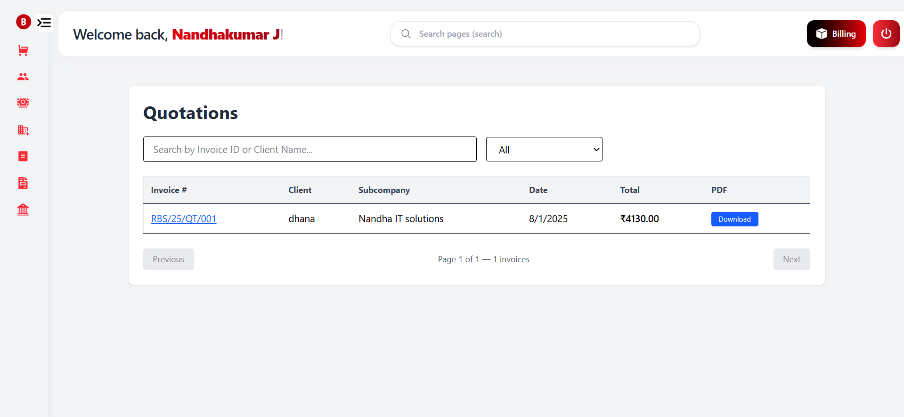
